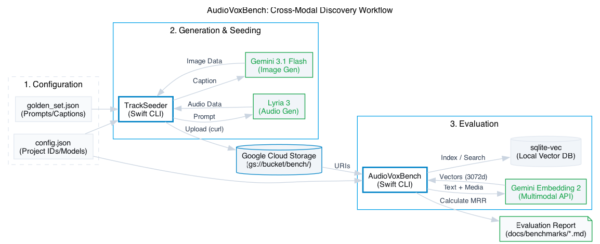

# AudioVoxBench: Multimodal Embedding Benchmark

`AudioVoxBench` is a standalone Swift command-line suite designed to evaluate semantic search relevance using the **Gemini Embedding 2** model. It allows developers to compare different indexing strategies (text-only vs. interleaved multimodal) to determine the highest possible search recall. For more background, see [Multimodal Ground Truth: Building AudioVoxBench](https://ghc.wtf/writing/multimodal-ground-truth-building-audiovoxbench/)



## Goals
- **Objective Measurement**: Calculate Mean Reciprocal Rank (MRR) for various "ensemble" embedding strategies.
- **Data-Driven Roadmap**: Identify if adding raw audio and image data to embeddings actually improves user search experience compared to rich text metadata.
- **Reproducibility**: Provide a consistent "Golden Set" of tracks and queries to track semantic search improvements over time.

## Components
1. **`TrackSeeder`**: A tool to generate audio (via Lyria 3) and images (via **Gemini 3.1 Flash Image / Nano Banana 2**) for a set of prompts defined in `golden_set.json`, and upload them to Google Cloud Storage.
2. **`AudioVoxBench`**: The main evaluation tool. It iterates through strategies, indexes the "Golden Set" into a local vector database (sqlite-vec), and runs ground-truth queries to score recall.

## Prerequisites
To run this suite independently, you need:
- **Google Cloud Project**: With the Vertex AI API enabled.
- **Permissions**: Your account (or service account) needs `aiplatform.user` and `storage.objectAdmin`.
- **Lyria API Access**: Specifically the `interactions` endpoint for audio generation.
- **GCS Bucket**: A bucket to host the multimodal assets (audio/mp3 and images/jpg).
- **Environment**: 
  - `GCP_ACCESS_TOKEN`: A valid OAuth2 token (run `gcloud auth print-access-token`).
  - Swift 5.9+ / macOS 14+.

## Quick Start
1. **Initial Setup**:
   ```bash
   cp config.json.sample config.json
   mkdir -p tests
   cp golden_set.json.sample tests/golden_set.json
   ```
2. **Prepare Data**: Edit `config.json` with your GCP Project details and `tests/golden_set.json` with your desired prompts.
3. **Seed Assets**: 
   ```bash
   export GCP_ACCESS_TOKEN=$(gcloud auth print-access-token)
   swift run TrackSeeder
   ```
4. **Run Benchmark**:
   ```bash
   swift run AudioVoxBench
   ```

## Benchmark Methodology
The suite uses a **Golden Set** methodology to simulate real-world semantic search pressure. 

1. **Test Set Generation**: We first use `TrackSeeder` to populate a local vector database with a diverse set of indexed tracks (the **Target Set**). These tracks are generated using specific prompts and captions to ensure a high-fidelity baseline.
2. **Hold-out Probes**: We then execute a series of **Hold-out Probes**—media assets (audio clips and images) that are *intentionally excluded* from the indexed database. These probes represent "novel" user inputs.
3. **Execution & Evaluation**: The application iterates through five embedding strategies (A-E). For each probe, it calculates the **Mean Reciprocal Rank (MRR)**—a metric that specifically rewards the "bullseye" rank of the semantically related track within the Target Set. This allows us to objectively determine which strategy offers the highest precision for cross-modal discovery.

### Using Existing Assets
`TrackSeeder` includes an optimization to skip expensive API generation if assets already exist locally. To use your own media library:
1. Place your MP3 and JPG files in the `seed_data/` folder.
2. Name them using the `id` from your `golden_set.json` (e.g., `track_001.mp3`, `track_001.jpg`).
3. Run `swift run TrackSeeder`. The tool will detect the files, skip Lyria/Gemini generation, and perform only the GCS upload and metadata preparation.

## Results & Reports
Benchmark results are stored in `docs/benchmarks/run_[date].md`.
Current "Winner": **Strategy C (Semantic Text-Augmentation)**. Strategy C consistently achieves a **1.0 MRR** even when queried with purely non-text media probes.

## Pricing Estimates (15-Asset Run)
Running this benchmark with 10 database tracks and 5 hold-out probes (13 audio clips, 12 images) costs approximately **$5.50 USD** on Vertex AI.

| Component | Quantity | Est. Unit Cost | Subtotal |
| :--- | :--- | :--- | :--- |
| **Audio** (Lyria 3) | 13 clips (30s ea) | $0.36 / clip | **$4.68** |
| **Images** (Gemini 3.1 Flash) | 12 images (1K) | $0.067 / image | **$0.80** |
| **Embeddings** (Gemini 2) | 200+ calls | $0.025 / 1M tokens | **<$0.01** |
| **TOTAL** | | | **~$5.49** |

*Note: Strategy C (Text-only) is the most cost-effective as it bypasses raw image/audio generation costs for subsequent searches.*
